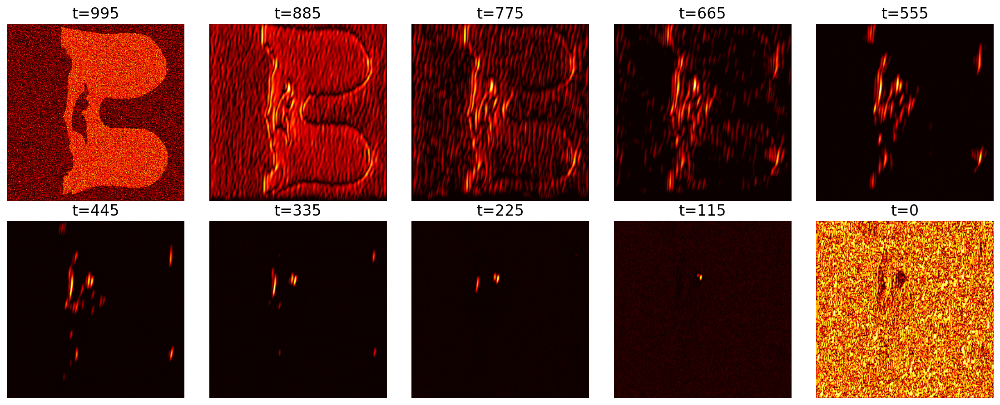

# Explainability in Generative Medical Diffusion Models: A Faithfulness-Based Analysis on MRI Synthesis

<p align="center">
  <a href="https://arxiv.org/pdf/2602.09781"></a>
  
  
  
  
</p>

> **Accepted at the 3rd World Congress on Smart Computing (WCSC 2026)**  
> Preprint: [arXiv:2602.09781](https://arxiv.org/pdf/2602.09781)  
> Authors: **Surjo Dey**, **Pallabi Saikia**

---

## Overview

This repository contains the official implementation of:

**"Explainability in Generative Medical Diffusion Models: A Faithfulness-Based Analysis on MRI Synthesis"**

We propose a structured explainability framework for diffusion-based medical image synthesis. A denoising diffusion model synthesizes breast MRI scans, while **prototype-based reasoning networks** (PPNet, EPPNet, ProtoPool) trace each generated image back to representative training examples. We then introduce **quantitative faithfulness evaluation** to measure how accurately these explanations reflect the true generative process — moving explainability from visual inspection to rigorous, metric-grounded analysis.

### Key Contributions

- A prototype-augmented diffusion pipeline for transparent MRI synthesis
- Three prototype reasoning architectures benchmarked under a unified evaluation framework
- **Normalized Influence Scores (NIS)**: a per-prototype metric quantifying each prototype's contribution to a generated image
- A faithfulness evaluation protocol that correlates NIS with structural output changes induced by prototype perturbation
- Systematic comparison of image quality (PSNR, SSIM, LPIPS) alongside explanation fidelity on clinical breast MRI data

---

## Method

<p align="center">
  
</p>
<p align="center"><em>Figure 1: Overall framework. A DDIM synthesizes MRI images from Gaussian noise; prototype networks then explain each generated output by matching it to training-set prototypes and computing Normalized Influence Scores.</em></p>

### 1. Diffusion Model (DDIM)

A **Denoising Diffusion Implicit Model (DDIM)** is trained on DCE breast MRI data to synthesize anatomically plausible images. The reverse diffusion process iteratively denoises from Gaussian noise through learned noise-estimation steps, reconstructing clinically meaningful structure at each timestep.

<p align="center">
  
</p>
<p align="center"><em>Figure 2: Noise prediction maps across reverse diffusion timesteps, illustrating how anatomical structure progressively emerges during the denoising process.</em></p>

### 2. Real vs. Synthetic MRI

<p align="center">
  
</p>
<p align="center"><em>Figure 3: Visual comparison of real DCE breast MRI scans (top) and DDIM-synthesized images (bottom), demonstrating high structural and textural fidelity of the generated samples.</em></p>

### 3. Prototype-Based Explainability

Three prototype methods are integrated with the diffusion backbone to explain generative decisions:

| Model | Description |
|---|---|
| **PPNet** | ProtoPNet: nearest-feature-patch prototype reasoning |
| **EPPNet** | Enhanced ProtoPNet with normalization and diversity regularization for stable explanations |
| **ProtoPool** | Shared prototype pool enabling flexible multi-class feature matching |

Each model computes **Normalized Influence Scores (NIS)** — scalars quantifying how strongly each training prototype contributed to a given generated image.

<p align="center">
  
</p>
<p align="center"><em>Figure 4: Normalized Influence Score (NIS) distributions across PPNet, EPPNet, and ProtoPool. EPPNet yields the most concentrated and discriminative scores, reflecting better prototype specificity.</em></p>

### 4. Faithfulness Evaluation

The faithfulness score measures alignment between a prototype's predicted NIS and the actual structural change it induces when perturbed in the generated output — providing a quantitative ground truth for evaluating explanation reliability.

```
Faithfulness = Corr( NIS(prototype_i),  Δ output structure | perturb prototype_i )
```

<p align="center">
  
</p>
<p align="center"><em>Figure 5: Faithfulness score comparison across the three prototype models. EPPNet achieves the highest faithfulness (0.1534), attributed to its normalization scheme which reduces redundancy among prototypes.</em></p>

---

## Repository Structure

```
Explainability/
│
├── EPPNet.py                    # Enhanced ProtoPNet model definition
├── ppnet.py                     # Standard ProtoPNet model definition
├── protopool.py                 # ProtoPool model definition
├── explain_diffusion.py         # Main explainability pipeline
├── Noise_pred_map.py            # Noise prediction map visualization
├── faithfulness_score.py        # Faithfulness metric computation
├── config.json                  # Experiment configuration
├── Figures/                     # Paper figures
│   ├── method.pdf               # Overall pipeline diagram
│   ├── noise_prediction_maps.pdf
│   ├── real_vs_fake.pdf
│   ├── nis.pdf
│   └── faithfulness.pdf
└── Synthetic Image/             # Example generated MRI outputs
```

---

## Dataset

We use the **Duke Breast Cancer MRI** dataset from [The Cancer Imaging Archive (TCIA)](https://www.cancerimagingarchive.net/collection/duke-breast-cancer-mri/).

This dataset provides dynamic contrast-enhanced (DCE) MRI scans covering both normal and abnormal breast tissue cases.

**Preprocessing pipeline:**
1. Intensity normalization
2. Bias-field correction
3. Spatial registration to a common anatomical template
4. Binary mask extraction for breast regions

> **Access:** Registration and agreement to the TCIA data use policy is required. See the [TCIA access portal](https://www.cancerimagingarchive.net/access-the-archive/).

---

## Installation

```bash
# Clone the repository
git clone https://github.com/surjo0/Explainability.git
cd Explainability
```

**Core dependencies:** Python ≥ 3.8, PyTorch ≥ 2.0, torchvision, numpy, scipy, scikit-image, lpips, matplotlib

---

## Usage

### 1. Configure the experiment

Edit `config.json` to point to your dataset and set hyperparameters:

```json
{
  "data_dir": "/path/to/breast_mri",
  "output_dir": "./outputs",
  "diffusion_steps": 1000,
  "prototype_model": "EPPNet",
  "num_prototypes": 10
}
```

### 2. Train the diffusion model

```bash
python explain_diffusion.py --mode train --config config.json
```

### 3. Generate synthetic MRI images

```bash
python explain_diffusion.py --mode generate --config config.json --num_samples 100
```

### 4. Compute faithfulness scores

```bash
python faithfulness_score.py --config config.json --model EPPNet
```

### 5. Visualize noise prediction maps

```bash
python Noise_pred_map.py --image_path "./Synthetic Image/" --config config.json
```

---

## Results

### Image Quality

| Metric | Mean ± SD |
|---|---|
| PSNR (dB) ↑ | 19.37 ± 1.67 |
| SSIM ↑ | 0.6530 ± 0.1052 |
| LPIPS ↓ | 0.2893 ± 0.1050 |

### Explainability Faithfulness

| Prototype Model | Faithfulness Score ↑ |
|---|---|
| PPNet | 0.0965 |
| ProtoPool | 0.1420 |
| **EPPNet** | **0.1534** |

EPPNet achieves the highest faithfulness score, attributable to its normalization and diversity regularization which reduce inter-prototype redundancy and sharpen alignment between influence scores and true generative factors.

---

## Citation

If you use this code or build on this work, please cite:

```bibtex
@article{dey2026explainability,
  title     = {Explainability in Generative Medical Diffusion Models: A Faithfulness-Based Analysis on MRI Synthesis},
  author    = {Dey, Surjo and Saikia, Pallabi},
  journal   = {arXiv preprint arXiv:2602.09781},
  year      = {2026}
}
```

---

## License

This project is licensed under the MIT License. See [LICENSE](LICENSE) for details.

---

## Contact

**Surjo Dey** — [@surjo0](https://github.com/surjo0)  
For questions or collaborations, please open an [issue](https://github.com/surjo0/Explainability/issues).
